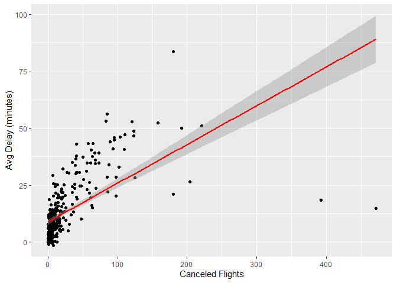

Homework 1
================
Haakon Carlson
9/22/2022

## Question 1

How many flights are missing a departure time? what other variables are
missing? What might these rows represent?

``` r
missing <- flights %>% 
  filter(is.na(dep_time)) %>% 
  select(dep_time,dep_delay,arr_time,arr_delay, air_time,sched_dep_time,sched_arr_time)

missing
```

    ## # A tibble: 8,255 x 7
    ##    dep_time dep_delay arr_time arr_delay air_time sched_dep_time sched_arr_time
    ##       <int>     <dbl>    <int>     <dbl>    <dbl>          <int>          <int>
    ##  1       NA        NA       NA        NA       NA           1630           1815
    ##  2       NA        NA       NA        NA       NA           1935           2240
    ##  3       NA        NA       NA        NA       NA           1500           1825
    ##  4       NA        NA       NA        NA       NA            600            901
    ##  5       NA        NA       NA        NA       NA           1540           1747
    ##  6       NA        NA       NA        NA       NA           1620           1746
    ##  7       NA        NA       NA        NA       NA           1355           1459
    ##  8       NA        NA       NA        NA       NA           1420           1644
    ##  9       NA        NA       NA        NA       NA           1321           1536
    ## 10       NA        NA       NA        NA       NA           1545           1910
    ## # ... with 8,245 more rows

**There are 8,255 flights missing dep\_time. These rows are also missing
the variables dep\_delay, arr\_time, arr\_delay, and air\_time. All
these flights do have sched\_dep\_time and sched\_arr\_time. These rows
likely represent flights that were scheduled to fly out but were
canceled due to some unforeseen event, i.e. weather.**

## Question 2

Currently dep\_time and sched\_dep\_time are convenient to look at, but
hard to compute with because they’re not really continuous numbers.
Convert them to a more convenient representation of number of minutes
since midnight.

``` r
new_time <- flights %>% 
  select(dep_time, sched_dep_time) %>% 
  mutate(new_dep_time = (dep_time %/% 100)*60 + (dep_time%%100), 
         new_sched_dep_time = (sched_dep_time%/%100)*60 + (sched_dep_time%%100))

new_time
```

    ## # A tibble: 336,776 x 4
    ##    dep_time sched_dep_time new_dep_time new_sched_dep_time
    ##       <int>          <int>        <dbl>              <dbl>
    ##  1      517            515          317                315
    ##  2      533            529          333                329
    ##  3      542            540          342                340
    ##  4      544            545          344                345
    ##  5      554            600          354                360
    ##  6      554            558          354                358
    ##  7      555            600          355                360
    ##  8      557            600          357                360
    ##  9      557            600          357                360
    ## 10      558            600          358                360
    ## # ... with 336,766 more rows

## Question 3

Look at the number of canceled flights per day. Is there a pattern? Is
the proportion of canceled flights related to the average delay? Use
multiple dyplr operations, all on one line, concluding with
ggplot(aes(x= ,y=)) + geom\_point()

``` r
flights %>% mutate(dep_date = make_datetime(year,month,day)) %>% group_by(dep_date) %>% summarise(canceled_flights = sum(is.na(dep_time)),avg_delay = mean(dep_delay, na.rm=T)) %>% ggplot(aes(x=canceled_flights, y=avg_delay)) + geom_point() + xlab("Canceled Flights") + ylab("Avg Delay (minutes)") + geom_smooth(method=lm, se=TRUE, col='red')
```

    ## `geom_smooth()` using formula 'y ~ x'

<!-- -->

**There seems to be a little bit of a relationship between number of
canceled flights and average delay on a given day. The relationship
looks almost logarithmic, although it is tough to tell from a glance.
There does seem to be a certain correlation that the when there are more
canceled flights the average delay is longer**
